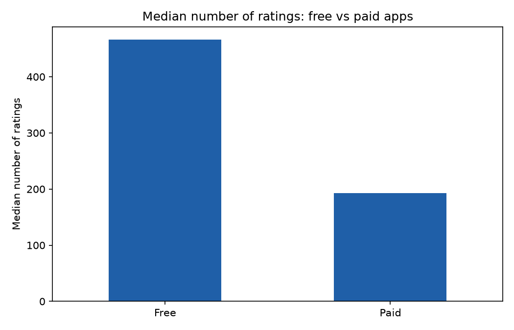
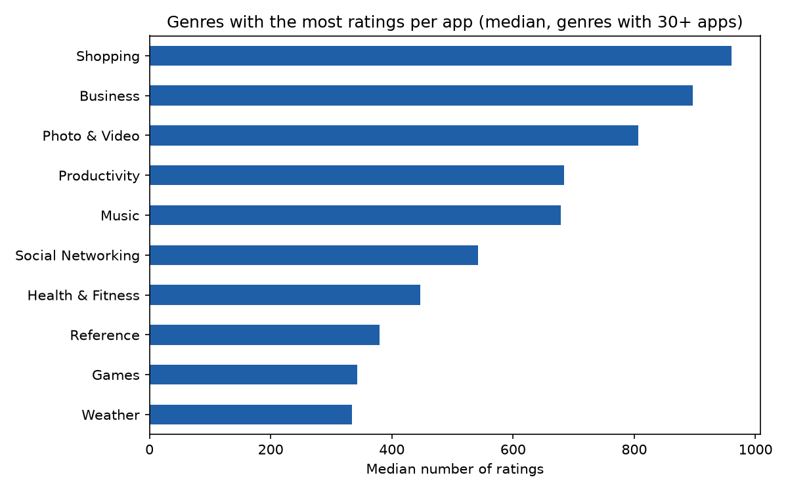
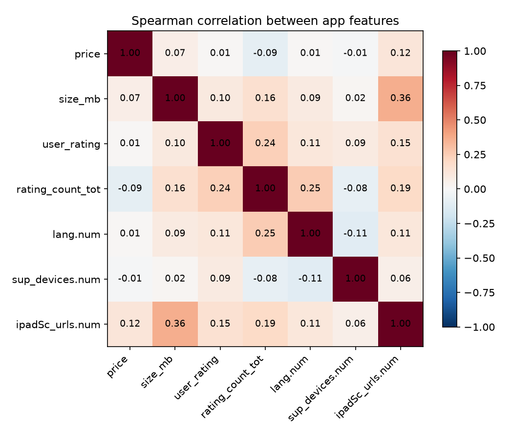

# Apple Store Mobile Apps: Data Analysis & Market Insights

Exploratory analysis of Apple App Store apps. It looks at how genre, price, and file size relate to how many ratings an app receives, using Python (Pandas, NumPy, Matplotlib).

## Questions
- Which genres have the most apps, and which get the most ratings per app?
- Do free and paid apps differ in popularity and average rating?
- How do price and file size relate to popularity?

## Dataset
Apple App Store apps dataset from Kaggle (search for "Mobile App Store" / `AppleStore.csv`). It is not included in this repo because of its license, so download it yourself and put `AppleStore.csv` in the project folder.

The dataset has no download counts. The **total number of ratings** (`rating_count_tot`) is used as a proxy for popularity.

## How to Run
```bash
git clone https://github.com/Moraytir/apple-store-analysis.git
cd apple-store-analysis
pip install -r requirements.txt
python analysis.py            # or: python analysis.py path/to/AppleStore.csv
```

The script cleans the data (removes duplicates, missing and invalid rows, treats a rating of 0 as "not rated"), then saves charts to `figures/` and tables to `outputs/`. `outputs/findings.txt` lists the key numbers.

## Method
1. Load the CSV and check the required columns
2. Clean: duplicates, missing values, invalid price or size, unrated apps
3. Create features: size in MB, free vs paid, price bands, size bands
4. Compare median ratings and mean user rating across genres, price bands, and size bands
5. Spearman correlation between numeric features (rank-based, so it is robust to the heavy skew in ratings)

## Results

Apps analysed: 7,197
Popularity proxy: total number of ratings (the dataset has no download counts).

Most apps: Games (3,862 apps, 53.7% of all apps).
Highest median number of ratings among genres with 30+ apps: Shopping (960).Free apps are 56.4% of the dataset. Median ratings: free 466 vs paid 193. Mean user rating: free 4.05 vs paid 4.05.

Spearman correlation with rating count: price -0.09, size_mb 0.16, user_rating 0.24.





## Limitations
- Ratings are a proxy for popularity, not downloads
- The data is a snapshot from one point in time
- Correlation does not show cause

## Tech Stack
Python (Pandas, NumPy, Matplotlib)
